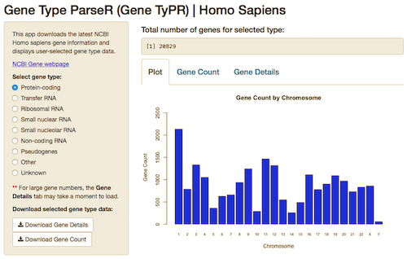

<style>
.reveal h1 {
    font-size: 2em;
    color: #ffffff;
    text-align: left;
    padding-bottom: 10px;
    font-family: Verdana, sans-serif;
}

.reveal h2 {
    font-size: 1.5em;
    color: #ffffff;
    text-align: left;
    padding-bottom: 10px;
    font-family: Verdana, sans-serif;
}

.reveal p {
    font-size: 0.75em;
    color: #ffffff;
    text-align: left;
    padding-bottom: 10px;
    font-family: Verdana, sans-serif;
}

.reveal span.accent {
    color: #13DAEC;
}

.reveal ol {
    padding-bottom: 20px;
}

.reveal ol li {
    font-size: 0.7em;
    margin-left: 0px;
    color: #ffffff;
    text-align: left;
    padding-bottom: 5px;
    font-family: Verdana, sans-serif;
}

img {     
  width: 700px; 
  height: 445px;
}
</style>

# Developing Data Products
## Course Project: Gene TyPR
-------------------------------------


[Walter Jessen](http://www.walterjessen.com)

Bioinformatician 

February 26th, 2016

---

## Introduction

This slidify presentation is part of the Course Project for the Coursera Developing Data Products class.

https://www.coursera.org/learn/data-products

The course project consists of two parts:

1. Create a Shiny application and deploy it on Rstudio's shiny server
2. Use Slidify or Rstudio Presenter to pitch the app

The app developed for the first part of the assignment is avalilable at:

[https://wjjessen.shinyapps.io/GeneTyPR/](https://wjjessen.shinyapps.io/GeneTyPR/)

Source code for ui.R and server.R files are available on GitHub:

[https://github.com/wjjessen/GeneTyPR/](https://github.com/wjjessen/GeneTyPR/)

The Slidify presentation can be viewed on GitHub:

[http://wjjessen.github.io/GeneTyPR/](http://wjjessen.github.io/GeneTyPR/)

---

## Gene TyPR Pitch

The Gene TyPR app (pronounced "Gene Typer", an acronym for Gene Type Parser) was developed with several goals in mind:

1. Download and analyze external data
2. Divide output into multiple independently viewable sections
3. Allow for user-selected information to be exported

Bioinformatics analysis often involves downloading and integrating public data from sites such as the National Center for Biotechnology Information, part of the United States National Library of Medicine, a branch of the National Institutes of Health.

http://www.ncbi.nlm.nih.gov/

The Gene TyPR app was designed to download the latest Homo sapiens gene information (updated nightly) from the NCBI, analyze and display user-selected gene type data, and allow for export.

---

## Gene TyPR data wrangling

The Gene TyPR app subsets the downloaded gene info data based on user-selected gene type. For example, the protein-coding data frame consists of five columns of data:

```{r}
hs<-readRDS("hs.R")
head(hs[(hs$GeneType=="protein-coding"),],2)
```

Once a gene type is selected, the app summarizes genes by chromosome and displays:

1. A barchart plot of gene count per chromosome
2. A data table summarizing the gene count per chromosome
3. A data table detailing all of the genes for the selected gene type

Data tables can be downloaded as comma-separated values (csv) files.

---

## Gene TyPR Interface

The Gene TyPR app has a tabbed interface that displays a **<span class=accent>Plot</span>** of the data (barchart), a table summarizing the user-selected gene type **<span class=accent>Gene Count</span>** per chromosome, and a table providing **<span class=accent>Gene Details</span>** for the selected gene type. Both data tables can be exported.

</img>
